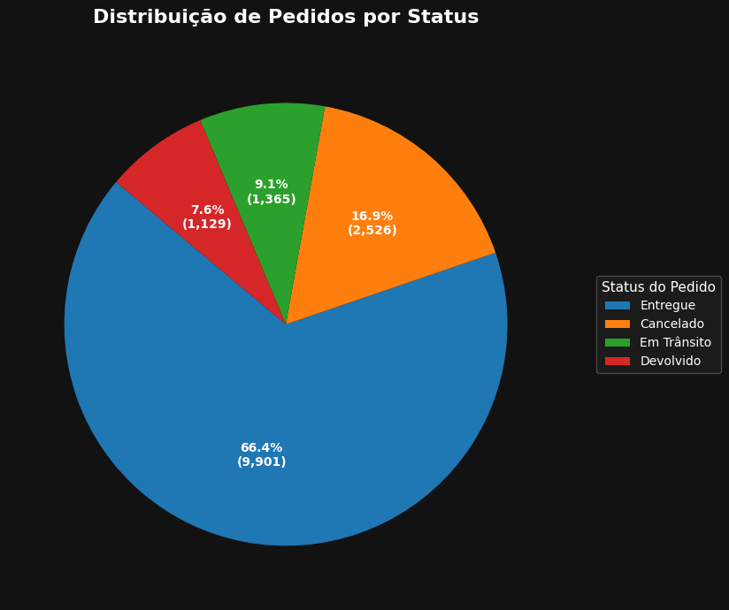
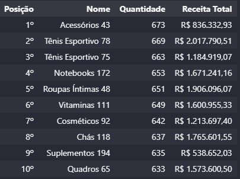
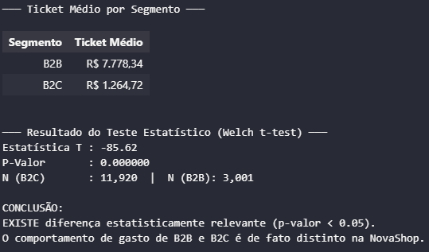
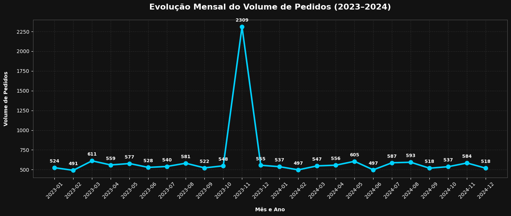
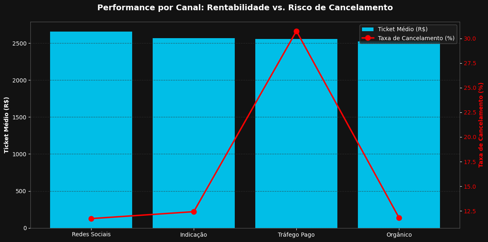
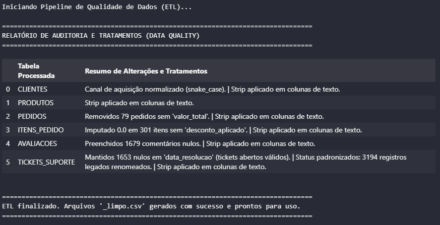

# NovaShop — Análise do Case (Peers Group)

Este repositório reúne a investigação realizada para o case NovaShop. O objetivo deste
documento é apresentar, de forma direta e narrativa, o contexto do projeto, como preparar o
ambiente, as respostas às seis questões do case com as evidências visuais e, por fim,
as hipóteses testadas, limitações e recomendações práticas.

---

## Contexto do projeto

- NovaShop: e‑commerce com operações B2C e B2B, base de clientes e histórico de pedidos
  fornecidos para o case.
- Problema central: entender padrões de pedidos (sazonalidade), diagnosticar o pico em
  novembro de 2023 e identificar por que a taxa de cancelamento/devolução é elevada,
  especialmente no canal de `trafego_pago`.

---

## Dependências e instalação

Recomenda-se usar um ambiente virtual e instalar as dependências listadas em
`requirements.txt`.

Git Bash / WSL:

```bash
python -m venv venv
source "venv/Scripts/activate"
pip install -r requirements.txt
```

Windows PowerShell:

```powershell
python -m venv venv
venv\Scripts\Activate.ps1
pip install -r requirements.txt
```

Para exploração interativa e geração das figuras, abra os notebooks em `questões/`.

---

## Questões do case (Q1–Q6) — Respostas e evidências

As respostas a seguir resumem o que foi calculado nos notebooks e apresentam a imagem
comprovante para cada questão. Não são referenciados artefatos de `outputs/` nesta seção;
os notebooks são a fonte das visualizações.

### Q1 — Volume de pedidos por status

- O que foi feito: contagem e percentual de pedidos por `status`.
- Resposta (síntese): `Entregue` é a maior parcela (~66%), `Cancelado` cerca de 17%,
  `Em Trânsito` ~9% e `Devolvido` ~7%.



### Q2 — Top 10 produtos (por quantidade e receita)

- O que foi feito: agregação por produto (quantidade e receita) e ordenação para top‑10.
- Resposta (síntese): lista de top10 produtos por volume e receita (ex.: `Acessórios 43`
  aparece entre os mais vendidos).



### Q3 — Ticket médio por segmento (B2C vs B2B)

- O que foi feito: cálculo de ticket médio por segmento e comparação estatística (Welch t‑test).
- Resposta (síntese): `B2B` tem ticket médio substancialmente maior que `B2C`; a diferença
  foi considerada estatisticamente significativa pelos testes aplicados.



### Q4 — Evolução mensal e pico em Nov/2023

- O que foi feito: série temporal mensal de volumes de pedidos (2023–2024) e identificação de picos.
- Resposta (síntese): pico pronunciado em `2023-11` foi detectado na série. A causa do pico
  não é óbvia apenas pela série; foram formuladas hipóteses para investigação posterior.



### Q5 — Canal com maior taxa de cancelamento

- O que foi feito: análise por `canal_aquisicao` com cálculo de taxa de cancelamento e ticket médio.
- Resposta (síntese): `trafego_pago` apresenta a maior taxa de cancelamento (ordem de ~30%) e
  ticket médio elevado — sinal de risco ligado à qualidade do tráfego.



### Q6 — Inconsistências e tratamento (ETL)

- O que foi feito: auditoria de qualidade de dados (valores nulos, duplicados, normalizações, imputações) e
  procedimentos de limpeza aplicados antes das análises.
- Resposta (síntese): principais tratamentos documentados e base preparada para análise.



---

## Hipóteses investigadas (o que foi testado, resultados e dados faltantes)

Aqui estão as hipóteses levantadas para explicar o pico de Nov/2023 (Q4) e a alta taxa de
cancelamento (Q5). Para cada hipótese indicamos se foi testada, o resultado e quais dados
adicionais seriam necessários para confirmar ou refutar de forma conclusiva.

> Observação técnica: os testes de hipótese automatizados foram implementados no
> `scripts/analise.py` (runner focado). Os artefatos dos testes (JSON/CSV) são gerados
> pelo runner e podem ser consultados quando necessário — exemplos: `q4_hypotheses.json`,
> `q5_channel_tests.json`.

### Hipótese A — Estratégia de descontos / penetração de cupom

- Testado: sim (comparação de penetração de cupom entre meses).
- Resultado: penetração de cupom em Nov/2023 não difere significativamente do mês de comparação; a hipótese
  de que uma promoção massiva por cupom foi a causa principal do pico não foi suportada.
- Dados adicionais desejáveis: histórico de campanhas (UTM, promoções, datas de veiculação), mapeamento de cupons para campanhas.

### Hipótese B — Concentração B2B atípica em Nov/2023

- Testado: sim (participação por segmento por mês).
- Resultado: participação B2B em Nov/2023 não explica o pico observado.
- Dados adicionais desejáveis: contratos, vendas diretas B2B detalhadas, notas fiscais por segmento.

### Hipótese C — Ruptura operacional / problemas de fulfillment

- Testado: parcialmente (comparação de status e tickets relacionados a pedidos cancelados).
- Resultado: não houve evidência clara que uma falha de fulfillment em massa seja a causa única do pico.
- Dados adicionais desejáveis: logs de expedição, tracking das transportadoras, registros de indisponibilidade de estoque.

### Hipótese D — Duplicação de dados (erro de ingestão)

- Testado: sim (checagem de duplicados por ID para o período).
- Resultado: não foram encontradas duplicações relevantes em Nov/2023.
- Dados adicionais desejáveis: logs de ingest/ETL para rastrear múltiplas cargas do mesmo lote.

### Hipótese E — Qualidade do tráfego pago (campanhas de baixo-quality / fraude)

- Testado: sim (comparação de taxas de cancelamento entre `trafego_pago` e outros canais por teste de proporções).
- Resultado: `trafego_pago` demonstra taxa de cancelamento estatisticamente maior que outros canais — indica hipótese plausível.
- Dados adicionais desejáveis: UTM detalhado (campaign, source, medium), dados do provedor de anúncios (campanha, custo, segmentação), logs de pagamento (recusas/estornos).

---

## Conclusão e próximos passos (papel do consultor)

1. Priorizar investigação do canal `trafego_pago`: parar/limitar campanhas suspeitas, auditar criativos e landing pages, checar segmentação.
2. Enriquecer dados: capturar `utm_campaign`/`utm_source`, `payment_status`/`payment_provider` e logs de fulfillment para análises aprofundadas.
3. Implementar monitoramento contínuo: dashboards de taxa de cancelamento por canal, alertas para aumentos atípicos e inspeção de pedidos de alto valor.
4. Operacional: auditar checkout e fluxo de pagamento (validações adicionais no cartão/pagamento) para reduzir cancelamentos por erro transacional.
5. Testes controlados: usar experimentos (A/B) ao ajustar campanhas pagas para medir impacto antes de reescalar investimento.

---

Desenvolvido por Gustavo Teixeira Bione
